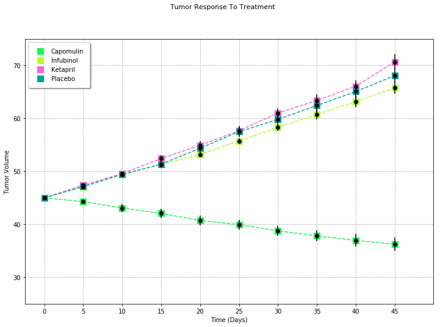
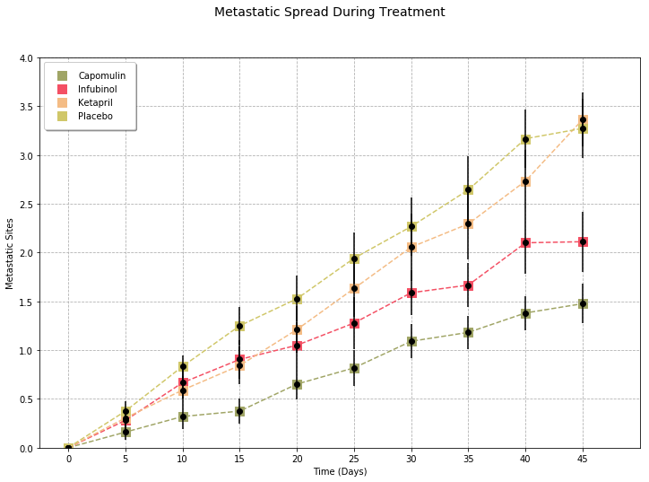
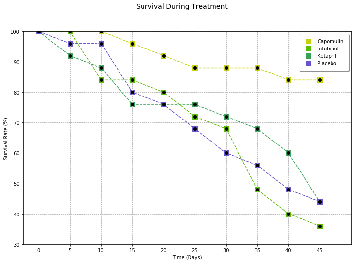
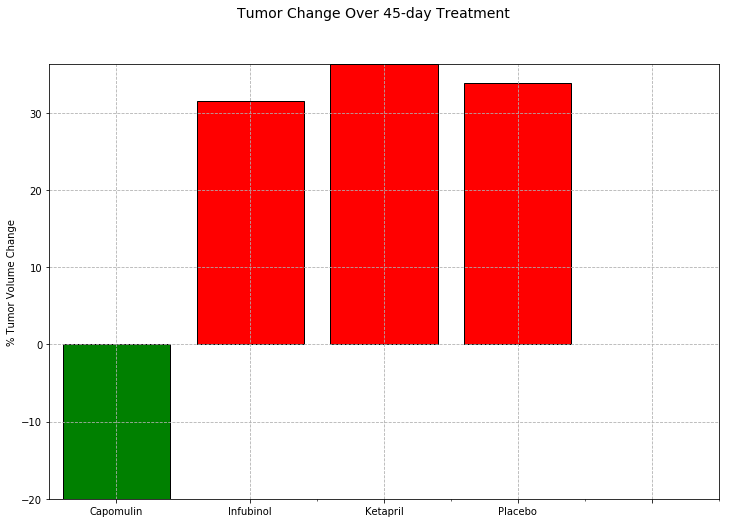

***
# <font color=blue>**Pymaceuticals, Inc**</font> 
***

## Squamous Cell Carcinoma Drug Treatment Analysis

### *Observed Trends:* 

1. *The Capumolin drug was the only treatment that resulted in a reduction in tumor volume over time as well as the 
    highest survival rate for lab mice over time*
1. *The survival rates of the test mice declined rapidly over time*
1. *The number of cancer-spreading sites increased over time for each treatment*


```python
import pandas as pd
import numpy as np
import matplotlib.pyplot as plt
from matplotlib.legend import Legend
from scipy.stats import sem

target_drugs = ['Capomulin', 'Infubinol', 'Ketapril', 'Placebo']
num_of_target_drugs = len(target_drugs)
```


```javascript
%%javascript
IPython.OutputArea.prototype._should_scroll = function(lines) {
    return false;
}
```


    <IPython.core.display.Javascript object>


```python
ct_data_df = pd.read_csv("raw_data/clinicaltrial_data.csv", low_memory=False)
md_data_df = pd.read_csv("raw_data/mouse_drug_data.csv", low_memory=False)
combined_data_df = pd.merge(ct_data_df, md_data_df, how='outer', on='Mouse ID')
combined_data_df.head()
```


<div>
<style scoped>
    .dataframe tbody tr th:only-of-type {
        vertical-align: middle;
    }

    .dataframe tbody tr th {
        vertical-align: top;
    }

    .dataframe thead th {
        text-align: right;
    }
</style>
<table border="1" class="dataframe">
  <thead>
    <tr style="text-align: right;">
      <th></th>
      <th>Mouse ID</th>
      <th>Timepoint</th>
      <th>Tumor Volume (mm3)</th>
      <th>Metastatic Sites</th>
      <th>Drug</th>
    </tr>
  </thead>
  <tbody>
    <tr>
      <th>0</th>
      <td>b128</td>
      <td>0</td>
      <td>45.000000</td>
      <td>0</td>
      <td>Capomulin</td>
    </tr>
    <tr>
      <th>1</th>
      <td>b128</td>
      <td>5</td>
      <td>45.651331</td>
      <td>0</td>
      <td>Capomulin</td>
    </tr>
    <tr>
      <th>2</th>
      <td>b128</td>
      <td>10</td>
      <td>43.270852</td>
      <td>0</td>
      <td>Capomulin</td>
    </tr>
    <tr>
      <th>3</th>
      <td>b128</td>
      <td>15</td>
      <td>43.784893</td>
      <td>0</td>
      <td>Capomulin</td>
    </tr>
    <tr>
      <th>4</th>
      <td>b128</td>
      <td>20</td>
      <td>42.731552</td>
      <td>0</td>
      <td>Capomulin</td>
    </tr>
  </tbody>
</table>
</div>


<br>
<br>
### Tumor Response to Treatment


```python
new_mean_df_grouped = combined_data_df.groupby(["Drug", "Timepoint"])[['Tumor Volume (mm3)']].mean()
new_mean_df_grouped
```


<div>
<style scoped>
    .dataframe tbody tr th:only-of-type {
        vertical-align: middle;
    }

    .dataframe tbody tr th {
        vertical-align: top;
    }

    .dataframe thead th {
        text-align: right;
    }
</style>
<table border="1" class="dataframe">
  <thead>
    <tr style="text-align: right;">
      <th></th>
      <th></th>
      <th>Tumor Volume (mm3)</th>
    </tr>
    <tr>
      <th>Drug</th>
      <th>Timepoint</th>
      <th></th>
    </tr>
  </thead>
  <tbody>
    <tr>
      <th rowspan="10" valign="top">Capomulin</th>
      <th>0</th>
      <td>45.000000</td>
    </tr>
    <tr>
      <th>5</th>
      <td>44.266086</td>
    </tr>
    <tr>
      <th>10</th>
      <td>43.084291</td>
    </tr>
    <tr>
      <th>15</th>
      <td>42.064317</td>
    </tr>
    <tr>
      <th>20</th>
      <td>40.716325</td>
    </tr>
    <tr>
      <th>25</th>
      <td>39.939528</td>
    </tr>
    <tr>
      <th>30</th>
      <td>38.769339</td>
    </tr>
    <tr>
      <th>35</th>
      <td>37.816839</td>
    </tr>
    <tr>
      <th>40</th>
      <td>36.958001</td>
    </tr>
    <tr>
      <th>45</th>
      <td>36.236114</td>
    </tr>
    <tr>
      <th rowspan="10" valign="top">Ceftamin</th>
      <th>0</th>
      <td>45.000000</td>
    </tr>
    <tr>
      <th>5</th>
      <td>46.503051</td>
    </tr>
    <tr>
      <th>10</th>
      <td>48.285125</td>
    </tr>
    <tr>
      <th>15</th>
      <td>50.094055</td>
    </tr>
    <tr>
      <th>20</th>
      <td>52.157049</td>
    </tr>
    <tr>
      <th>25</th>
      <td>54.287674</td>
    </tr>
    <tr>
      <th>30</th>
      <td>56.769517</td>
    </tr>
    <tr>
      <th>35</th>
      <td>58.827548</td>
    </tr>
    <tr>
      <th>40</th>
      <td>61.467895</td>
    </tr>
    <tr>
      <th>45</th>
      <td>64.132421</td>
    </tr>
    <tr>
      <th rowspan="10" valign="top">Infubinol</th>
      <th>0</th>
      <td>45.000000</td>
    </tr>
    <tr>
      <th>5</th>
      <td>47.062001</td>
    </tr>
    <tr>
      <th>10</th>
      <td>49.403909</td>
    </tr>
    <tr>
      <th>15</th>
      <td>51.296397</td>
    </tr>
    <tr>
      <th>20</th>
      <td>53.197691</td>
    </tr>
    <tr>
      <th>25</th>
      <td>55.715252</td>
    </tr>
    <tr>
      <th>30</th>
      <td>58.299397</td>
    </tr>
    <tr>
      <th>35</th>
      <td>60.742461</td>
    </tr>
    <tr>
      <th>40</th>
      <td>63.162824</td>
    </tr>
    <tr>
      <th>45</th>
      <td>65.755562</td>
    </tr>
    <tr>
      <th>...</th>
      <th>...</th>
      <td>...</td>
    </tr>
    <tr>
      <th rowspan="10" valign="top">Ramicane</th>
      <th>0</th>
      <td>45.000000</td>
    </tr>
    <tr>
      <th>5</th>
      <td>43.944859</td>
    </tr>
    <tr>
      <th>10</th>
      <td>42.531957</td>
    </tr>
    <tr>
      <th>15</th>
      <td>41.495061</td>
    </tr>
    <tr>
      <th>20</th>
      <td>40.238325</td>
    </tr>
    <tr>
      <th>25</th>
      <td>38.974300</td>
    </tr>
    <tr>
      <th>30</th>
      <td>38.703137</td>
    </tr>
    <tr>
      <th>35</th>
      <td>37.451996</td>
    </tr>
    <tr>
      <th>40</th>
      <td>36.574081</td>
    </tr>
    <tr>
      <th>45</th>
      <td>34.955595</td>
    </tr>
    <tr>
      <th rowspan="10" valign="top">Stelasyn</th>
      <th>0</th>
      <td>45.000000</td>
    </tr>
    <tr>
      <th>5</th>
      <td>47.527452</td>
    </tr>
    <tr>
      <th>10</th>
      <td>49.463844</td>
    </tr>
    <tr>
      <th>15</th>
      <td>51.529409</td>
    </tr>
    <tr>
      <th>20</th>
      <td>54.067395</td>
    </tr>
    <tr>
      <th>25</th>
      <td>56.166123</td>
    </tr>
    <tr>
      <th>30</th>
      <td>59.826738</td>
    </tr>
    <tr>
      <th>35</th>
      <td>62.440699</td>
    </tr>
    <tr>
      <th>40</th>
      <td>65.356386</td>
    </tr>
    <tr>
      <th>45</th>
      <td>68.438310</td>
    </tr>
    <tr>
      <th rowspan="10" valign="top">Zoniferol</th>
      <th>0</th>
      <td>45.000000</td>
    </tr>
    <tr>
      <th>5</th>
      <td>46.851818</td>
    </tr>
    <tr>
      <th>10</th>
      <td>48.689881</td>
    </tr>
    <tr>
      <th>15</th>
      <td>50.779059</td>
    </tr>
    <tr>
      <th>20</th>
      <td>53.170334</td>
    </tr>
    <tr>
      <th>25</th>
      <td>55.432935</td>
    </tr>
    <tr>
      <th>30</th>
      <td>57.713531</td>
    </tr>
    <tr>
      <th>35</th>
      <td>60.089372</td>
    </tr>
    <tr>
      <th>40</th>
      <td>62.916692</td>
    </tr>
    <tr>
      <th>45</th>
      <td>65.960888</td>
    </tr>
  </tbody>
</table>
<p>100 rows × 1 columns</p>
</div>


```python
new_sem_df_grouped = combined_data_df.groupby(["Drug", "Timepoint"])[['Tumor Volume (mm3)']].sem()
new_sem_df_grouped.head(15)
```


<div>
<style scoped>
    .dataframe tbody tr th:only-of-type {
        vertical-align: middle;
    }

    .dataframe tbody tr th {
        vertical-align: top;
    }

    .dataframe thead th {
        text-align: right;
    }
</style>
<table border="1" class="dataframe">
  <thead>
    <tr style="text-align: right;">
      <th></th>
      <th></th>
      <th>Tumor Volume (mm3)</th>
    </tr>
    <tr>
      <th>Drug</th>
      <th>Timepoint</th>
      <th></th>
    </tr>
  </thead>
  <tbody>
    <tr>
      <th rowspan="10" valign="top">Capomulin</th>
      <th>0</th>
      <td>0.000000</td>
    </tr>
    <tr>
      <th>5</th>
      <td>0.448593</td>
    </tr>
    <tr>
      <th>10</th>
      <td>0.702684</td>
    </tr>
    <tr>
      <th>15</th>
      <td>0.838617</td>
    </tr>
    <tr>
      <th>20</th>
      <td>0.909731</td>
    </tr>
    <tr>
      <th>25</th>
      <td>0.881642</td>
    </tr>
    <tr>
      <th>30</th>
      <td>0.934460</td>
    </tr>
    <tr>
      <th>35</th>
      <td>1.052241</td>
    </tr>
    <tr>
      <th>40</th>
      <td>1.223608</td>
    </tr>
    <tr>
      <th>45</th>
      <td>1.223977</td>
    </tr>
    <tr>
      <th rowspan="5" valign="top">Ceftamin</th>
      <th>0</th>
      <td>0.000000</td>
    </tr>
    <tr>
      <th>5</th>
      <td>0.164505</td>
    </tr>
    <tr>
      <th>10</th>
      <td>0.236144</td>
    </tr>
    <tr>
      <th>15</th>
      <td>0.332053</td>
    </tr>
    <tr>
      <th>20</th>
      <td>0.359482</td>
    </tr>
  </tbody>
</table>
</div>


```python
tumor_vol_mean_df = new_mean_df_grouped.pivot_table(index=["Timepoint"], values=["Tumor Volume (mm3)"], columns=["Drug"])
tumor_vol_mean_df.head()
```


<div>
<style scoped>
    .dataframe tbody tr th:only-of-type {
        vertical-align: middle;
    }

    .dataframe tbody tr th {
        vertical-align: top;
    }

    .dataframe thead tr th {
        text-align: left;
    }

    .dataframe thead tr:last-of-type th {
        text-align: right;
    }
</style>
<table border="1" class="dataframe">
  <thead>
    <tr>
      <th></th>
      <th colspan="10" halign="left">Tumor Volume (mm3)</th>
    </tr>
    <tr>
      <th>Drug</th>
      <th>Capomulin</th>
      <th>Ceftamin</th>
      <th>Infubinol</th>
      <th>Ketapril</th>
      <th>Naftisol</th>
      <th>Placebo</th>
      <th>Propriva</th>
      <th>Ramicane</th>
      <th>Stelasyn</th>
      <th>Zoniferol</th>
    </tr>
    <tr>
      <th>Timepoint</th>
      <th></th>
      <th></th>
      <th></th>
      <th></th>
      <th></th>
      <th></th>
      <th></th>
      <th></th>
      <th></th>
      <th></th>
    </tr>
  </thead>
  <tbody>
    <tr>
      <th>0</th>
      <td>45.000000</td>
      <td>45.000000</td>
      <td>45.000000</td>
      <td>45.000000</td>
      <td>45.000000</td>
      <td>45.000000</td>
      <td>45.000000</td>
      <td>45.000000</td>
      <td>45.000000</td>
      <td>45.000000</td>
    </tr>
    <tr>
      <th>5</th>
      <td>44.266086</td>
      <td>46.503051</td>
      <td>47.062001</td>
      <td>47.389175</td>
      <td>46.796098</td>
      <td>47.125589</td>
      <td>47.248967</td>
      <td>43.944859</td>
      <td>47.527452</td>
      <td>46.851818</td>
    </tr>
    <tr>
      <th>10</th>
      <td>43.084291</td>
      <td>48.285125</td>
      <td>49.403909</td>
      <td>49.582269</td>
      <td>48.694210</td>
      <td>49.423329</td>
      <td>49.101541</td>
      <td>42.531957</td>
      <td>49.463844</td>
      <td>48.689881</td>
    </tr>
    <tr>
      <th>15</th>
      <td>42.064317</td>
      <td>50.094055</td>
      <td>51.296397</td>
      <td>52.399974</td>
      <td>50.933018</td>
      <td>51.359742</td>
      <td>51.067318</td>
      <td>41.495061</td>
      <td>51.529409</td>
      <td>50.779059</td>
    </tr>
    <tr>
      <th>20</th>
      <td>40.716325</td>
      <td>52.157049</td>
      <td>53.197691</td>
      <td>54.920935</td>
      <td>53.644087</td>
      <td>54.364417</td>
      <td>53.346737</td>
      <td>40.238325</td>
      <td>54.067395</td>
      <td>53.170334</td>
    </tr>
  </tbody>
</table>
</div>


```python
tumor_vol_sem_df = new_sem_df_grouped.pivot_table(index=["Timepoint"], values=["Tumor Volume (mm3)"], columns=["Drug"])
tumor_vol_sem_df.head()
```


<div>
<style scoped>
    .dataframe tbody tr th:only-of-type {
        vertical-align: middle;
    }

    .dataframe tbody tr th {
        vertical-align: top;
    }

    .dataframe thead tr th {
        text-align: left;
    }

    .dataframe thead tr:last-of-type th {
        text-align: right;
    }
</style>
<table border="1" class="dataframe">
  <thead>
    <tr>
      <th></th>
      <th colspan="10" halign="left">Tumor Volume (mm3)</th>
    </tr>
    <tr>
      <th>Drug</th>
      <th>Capomulin</th>
      <th>Ceftamin</th>
      <th>Infubinol</th>
      <th>Ketapril</th>
      <th>Naftisol</th>
      <th>Placebo</th>
      <th>Propriva</th>
      <th>Ramicane</th>
      <th>Stelasyn</th>
      <th>Zoniferol</th>
    </tr>
    <tr>
      <th>Timepoint</th>
      <th></th>
      <th></th>
      <th></th>
      <th></th>
      <th></th>
      <th></th>
      <th></th>
      <th></th>
      <th></th>
      <th></th>
    </tr>
  </thead>
  <tbody>
    <tr>
      <th>0</th>
      <td>0.000000</td>
      <td>0.000000</td>
      <td>0.000000</td>
      <td>0.000000</td>
      <td>0.000000</td>
      <td>0.000000</td>
      <td>0.000000</td>
      <td>0.000000</td>
      <td>0.000000</td>
      <td>0.000000</td>
    </tr>
    <tr>
      <th>5</th>
      <td>0.448593</td>
      <td>0.164505</td>
      <td>0.235102</td>
      <td>0.264819</td>
      <td>0.202385</td>
      <td>0.218091</td>
      <td>0.231708</td>
      <td>0.482955</td>
      <td>0.239862</td>
      <td>0.188950</td>
    </tr>
    <tr>
      <th>10</th>
      <td>0.702684</td>
      <td>0.236144</td>
      <td>0.282346</td>
      <td>0.357421</td>
      <td>0.319415</td>
      <td>0.402064</td>
      <td>0.376195</td>
      <td>0.720225</td>
      <td>0.433678</td>
      <td>0.263949</td>
    </tr>
    <tr>
      <th>15</th>
      <td>0.838617</td>
      <td>0.332053</td>
      <td>0.357705</td>
      <td>0.580268</td>
      <td>0.444378</td>
      <td>0.614461</td>
      <td>0.466109</td>
      <td>0.770432</td>
      <td>0.493261</td>
      <td>0.370544</td>
    </tr>
    <tr>
      <th>20</th>
      <td>0.909731</td>
      <td>0.359482</td>
      <td>0.476210</td>
      <td>0.726484</td>
      <td>0.595260</td>
      <td>0.839609</td>
      <td>0.555181</td>
      <td>0.786199</td>
      <td>0.621889</td>
      <td>0.533182</td>
    </tr>
  </tbody>
</table>
</div>


```python
target_drugs_tumor_vol_mean_df = tumor_vol_mean_df.loc[:, ('Tumor Volume (mm3)', target_drugs)]
print(target_drugs_tumor_vol_mean_df)

vol_list = list((target_drugs_tumor_vol_mean_df.as_matrix(columns=target_drugs_tumor_vol_mean_df.columns[0:1])).flatten())
drug_group_mean_vol = vol_list

for i in range(num_of_target_drugs - 1):
    vol_list = list((target_drugs_tumor_vol_mean_df.as_matrix(columns=target_drugs_tumor_vol_mean_df.columns[i+1:i+2])).flatten())
    drug_group_mean_vol = np.vstack([drug_group_mean_vol, vol_list])
    
```

              Tumor Volume (mm3)                                 
    Drug               Capomulin  Infubinol   Ketapril    Placebo
    Timepoint                                                    
    0                  45.000000  45.000000  45.000000  45.000000
    5                  44.266086  47.062001  47.389175  47.125589
    10                 43.084291  49.403909  49.582269  49.423329
    15                 42.064317  51.296397  52.399974  51.359742
    20                 40.716325  53.197691  54.920935  54.364417
    25                 39.939528  55.715252  57.678982  57.482574
    30                 38.769339  58.299397  60.994507  59.809063
    35                 37.816839  60.742461  63.371686  62.420615
    40                 36.958001  63.162824  66.068580  65.052675
    45                 36.236114  65.755562  70.662958  68.084082
    


```python
target_drugs_tumor_vol_sem_df = tumor_vol_sem_df.loc[:, ('Tumor Volume (mm3)', target_drugs)]
print(target_drugs_tumor_vol_sem_df)

vol_list2 = list((target_drugs_tumor_vol_sem_df.as_matrix(columns=target_drugs_tumor_vol_sem_df.columns[0:1])).flatten())
drug_group_sem_vol = vol_list2

for i in range(num_of_target_drugs - 1):
    vol_list2 = list((target_drugs_tumor_vol_sem_df.as_matrix(columns=target_drugs_tumor_vol_sem_df.columns[i+1:i+2])).flatten())
    drug_group_sem_vol = np.vstack([drug_group_sem_vol, vol_list2])

```

              Tumor Volume (mm3)                              
    Drug               Capomulin Infubinol  Ketapril   Placebo
    Timepoint                                                 
    0                   0.000000  0.000000  0.000000  0.000000
    5                   0.448593  0.235102  0.264819  0.218091
    10                  0.702684  0.282346  0.357421  0.402064
    15                  0.838617  0.357705  0.580268  0.614461
    20                  0.909731  0.476210  0.726484  0.839609
    25                  0.881642  0.550315  0.755413  1.034872
    30                  0.934460  0.631061  0.934121  1.218231
    35                  1.052241  0.984155  1.127867  1.287481
    40                  1.223608  1.055220  1.158449  1.370634
    45                  1.223977  1.144427  1.453186  1.351726
    


```python
time_values = list(target_drugs_tumor_vol_mean_df.index.get_level_values('Timepoint'))
print(time_values)
```

    [0, 5, 10, 15, 20, 25, 30, 35, 40, 45]
    


```python
fig, ax = plt.subplots(figsize=(12,8))
fig.suptitle("Tumor Response To Treatment", fontsize=11)

x_axis = np.arange(0, len(time_values), 1)
ax.margins(0.05)
ax.grid(ls='dashed')
ax.set_xlim(-0.5, len(time_values))
ax.set_ylim(25, 75)
ax.set_xticks(range(0, len(time_values)))
ax.set_xticklabels(time_values)
ax.set_ylabel("Tumor Volume")
ax.set_xlabel("Time (Days)")

for name, means, sems in zip(target_drugs, drug_group_mean_vol, drug_group_sem_vol):
    plot_color = np.random.rand(3,)
    ax.scatter(x_axis, means, s=90, marker='s', label=name, c=plot_color)
    ax.plot(x_axis, means, '--', ms=12, c=plot_color)
    ax.errorbar(x_axis, means, yerr=sems, fmt='o', c='#000000')

ax.legend(loc="best", fontsize="medium", fancybox=True, shadow=True, borderpad=1)

plt.show()

```





<br>
<br>
### Metastatic Response to Treatment 


```python
meta_df_grouped = combined_data_df.groupby(["Drug", "Timepoint"])[['Metastatic Sites']].mean()
meta_df_grouped.head()
```


<div>
<style scoped>
    .dataframe tbody tr th:only-of-type {
        vertical-align: middle;
    }

    .dataframe tbody tr th {
        vertical-align: top;
    }

    .dataframe thead th {
        text-align: right;
    }
</style>
<table border="1" class="dataframe">
  <thead>
    <tr style="text-align: right;">
      <th></th>
      <th></th>
      <th>Metastatic Sites</th>
    </tr>
    <tr>
      <th>Drug</th>
      <th>Timepoint</th>
      <th></th>
    </tr>
  </thead>
  <tbody>
    <tr>
      <th rowspan="5" valign="top">Capomulin</th>
      <th>0</th>
      <td>0.000000</td>
    </tr>
    <tr>
      <th>5</th>
      <td>0.160000</td>
    </tr>
    <tr>
      <th>10</th>
      <td>0.320000</td>
    </tr>
    <tr>
      <th>15</th>
      <td>0.375000</td>
    </tr>
    <tr>
      <th>20</th>
      <td>0.652174</td>
    </tr>
  </tbody>
</table>
</div>


```python
meta_sem_df_grouped = combined_data_df.groupby(["Drug", "Timepoint"])[['Metastatic Sites']].sem()
meta_sem_df_grouped.head()
```


<div>
<style scoped>
    .dataframe tbody tr th:only-of-type {
        vertical-align: middle;
    }

    .dataframe tbody tr th {
        vertical-align: top;
    }

    .dataframe thead th {
        text-align: right;
    }
</style>
<table border="1" class="dataframe">
  <thead>
    <tr style="text-align: right;">
      <th></th>
      <th></th>
      <th>Metastatic Sites</th>
    </tr>
    <tr>
      <th>Drug</th>
      <th>Timepoint</th>
      <th></th>
    </tr>
  </thead>
  <tbody>
    <tr>
      <th rowspan="5" valign="top">Capomulin</th>
      <th>0</th>
      <td>0.000000</td>
    </tr>
    <tr>
      <th>5</th>
      <td>0.074833</td>
    </tr>
    <tr>
      <th>10</th>
      <td>0.125433</td>
    </tr>
    <tr>
      <th>15</th>
      <td>0.132048</td>
    </tr>
    <tr>
      <th>20</th>
      <td>0.161621</td>
    </tr>
  </tbody>
</table>
</div>


```python
meta_df2 = meta_df_grouped.pivot_table(index=["Timepoint"], values=["Metastatic Sites"], columns=["Drug"])
meta_df2.head()
```


<div>
<style scoped>
    .dataframe tbody tr th:only-of-type {
        vertical-align: middle;
    }

    .dataframe tbody tr th {
        vertical-align: top;
    }

    .dataframe thead tr th {
        text-align: left;
    }

    .dataframe thead tr:last-of-type th {
        text-align: right;
    }
</style>
<table border="1" class="dataframe">
  <thead>
    <tr>
      <th></th>
      <th colspan="10" halign="left">Metastatic Sites</th>
    </tr>
    <tr>
      <th>Drug</th>
      <th>Capomulin</th>
      <th>Ceftamin</th>
      <th>Infubinol</th>
      <th>Ketapril</th>
      <th>Naftisol</th>
      <th>Placebo</th>
      <th>Propriva</th>
      <th>Ramicane</th>
      <th>Stelasyn</th>
      <th>Zoniferol</th>
    </tr>
    <tr>
      <th>Timepoint</th>
      <th></th>
      <th></th>
      <th></th>
      <th></th>
      <th></th>
      <th></th>
      <th></th>
      <th></th>
      <th></th>
      <th></th>
    </tr>
  </thead>
  <tbody>
    <tr>
      <th>0</th>
      <td>0.000000</td>
      <td>0.000000</td>
      <td>0.000000</td>
      <td>0.000000</td>
      <td>0.000000</td>
      <td>0.000000</td>
      <td>0.000000</td>
      <td>0.000000</td>
      <td>0.000000</td>
      <td>0.000000</td>
    </tr>
    <tr>
      <th>5</th>
      <td>0.160000</td>
      <td>0.380952</td>
      <td>0.280000</td>
      <td>0.304348</td>
      <td>0.260870</td>
      <td>0.375000</td>
      <td>0.320000</td>
      <td>0.120000</td>
      <td>0.240000</td>
      <td>0.166667</td>
    </tr>
    <tr>
      <th>10</th>
      <td>0.320000</td>
      <td>0.600000</td>
      <td>0.666667</td>
      <td>0.590909</td>
      <td>0.523810</td>
      <td>0.833333</td>
      <td>0.565217</td>
      <td>0.250000</td>
      <td>0.478261</td>
      <td>0.500000</td>
    </tr>
    <tr>
      <th>15</th>
      <td>0.375000</td>
      <td>0.789474</td>
      <td>0.904762</td>
      <td>0.842105</td>
      <td>0.857143</td>
      <td>1.250000</td>
      <td>0.764706</td>
      <td>0.333333</td>
      <td>0.782609</td>
      <td>0.809524</td>
    </tr>
    <tr>
      <th>20</th>
      <td>0.652174</td>
      <td>1.111111</td>
      <td>1.050000</td>
      <td>1.210526</td>
      <td>1.150000</td>
      <td>1.526316</td>
      <td>1.000000</td>
      <td>0.347826</td>
      <td>0.952381</td>
      <td>1.294118</td>
    </tr>
  </tbody>
</table>
</div>


```python
meta_sem_df2 = meta_sem_df_grouped.pivot_table(index=["Timepoint"], values=["Metastatic Sites"], columns=["Drug"])
meta_sem_df2.head()
```


<div>
<style scoped>
    .dataframe tbody tr th:only-of-type {
        vertical-align: middle;
    }

    .dataframe tbody tr th {
        vertical-align: top;
    }

    .dataframe thead tr th {
        text-align: left;
    }

    .dataframe thead tr:last-of-type th {
        text-align: right;
    }
</style>
<table border="1" class="dataframe">
  <thead>
    <tr>
      <th></th>
      <th colspan="10" halign="left">Metastatic Sites</th>
    </tr>
    <tr>
      <th>Drug</th>
      <th>Capomulin</th>
      <th>Ceftamin</th>
      <th>Infubinol</th>
      <th>Ketapril</th>
      <th>Naftisol</th>
      <th>Placebo</th>
      <th>Propriva</th>
      <th>Ramicane</th>
      <th>Stelasyn</th>
      <th>Zoniferol</th>
    </tr>
    <tr>
      <th>Timepoint</th>
      <th></th>
      <th></th>
      <th></th>
      <th></th>
      <th></th>
      <th></th>
      <th></th>
      <th></th>
      <th></th>
      <th></th>
    </tr>
  </thead>
  <tbody>
    <tr>
      <th>0</th>
      <td>0.000000</td>
      <td>0.000000</td>
      <td>0.000000</td>
      <td>0.000000</td>
      <td>0.000000</td>
      <td>0.000000</td>
      <td>0.000000</td>
      <td>0.000000</td>
      <td>0.000000</td>
      <td>0.000000</td>
    </tr>
    <tr>
      <th>5</th>
      <td>0.074833</td>
      <td>0.108588</td>
      <td>0.091652</td>
      <td>0.098100</td>
      <td>0.093618</td>
      <td>0.100947</td>
      <td>0.095219</td>
      <td>0.066332</td>
      <td>0.087178</td>
      <td>0.077709</td>
    </tr>
    <tr>
      <th>10</th>
      <td>0.125433</td>
      <td>0.152177</td>
      <td>0.159364</td>
      <td>0.142018</td>
      <td>0.163577</td>
      <td>0.115261</td>
      <td>0.105690</td>
      <td>0.090289</td>
      <td>0.123672</td>
      <td>0.109109</td>
    </tr>
    <tr>
      <th>15</th>
      <td>0.132048</td>
      <td>0.180625</td>
      <td>0.194015</td>
      <td>0.191381</td>
      <td>0.158651</td>
      <td>0.190221</td>
      <td>0.136377</td>
      <td>0.115261</td>
      <td>0.153439</td>
      <td>0.111677</td>
    </tr>
    <tr>
      <th>20</th>
      <td>0.161621</td>
      <td>0.241034</td>
      <td>0.234801</td>
      <td>0.236680</td>
      <td>0.181731</td>
      <td>0.234064</td>
      <td>0.171499</td>
      <td>0.119430</td>
      <td>0.200905</td>
      <td>0.166378</td>
    </tr>
  </tbody>
</table>
</div>


```python
target_drugs_meta_mean_df = meta_df2.loc[:, ('Metastatic Sites', target_drugs)]
print(target_drugs_meta_mean_df)
print('---------------------------------------------------------------------')

meta_list = list((target_drugs_meta_mean_df.as_matrix(columns=target_drugs_meta_mean_df.columns[0:1])).flatten())
drug_group_mean_meta = meta_list

for i in range(num_of_target_drugs - 1):
    meta_list = list((target_drugs_meta_mean_df.as_matrix(columns=target_drugs_meta_mean_df.columns[i+1:i+2])).flatten())
    drug_group_mean_meta = np.vstack([drug_group_mean_meta, meta_list]) 

target_drugs_meta_sem_df = meta_sem_df2.loc[:, ('Metastatic Sites', target_drugs)]
print(target_drugs_meta_sem_df)
print('---------------------------------------------------------------------')

meta_list = list((target_drugs_meta_sem_df.as_matrix(columns=target_drugs_meta_sem_df.columns[0:1])).flatten())
drug_group_sem_meta = meta_list

for i in range(num_of_target_drugs - 1):
    meta_list = list((target_drugs_meta_sem_df.as_matrix(columns=target_drugs_meta_sem_df.columns[i+1:i+2])).flatten())
    drug_group_sem_meta = np.vstack([drug_group_sem_meta, meta_list])
    
time_values = list(target_drugs_meta_mean_df.index.get_level_values('Timepoint'))
```

              Metastatic Sites                              
    Drug             Capomulin Infubinol  Ketapril   Placebo
    Timepoint                                               
    0                 0.000000  0.000000  0.000000  0.000000
    5                 0.160000  0.280000  0.304348  0.375000
    10                0.320000  0.666667  0.590909  0.833333
    15                0.375000  0.904762  0.842105  1.250000
    20                0.652174  1.050000  1.210526  1.526316
    25                0.818182  1.277778  1.631579  1.941176
    30                1.090909  1.588235  2.055556  2.266667
    35                1.181818  1.666667  2.294118  2.642857
    40                1.380952  2.100000  2.733333  3.166667
    45                1.476190  2.111111  3.363636  3.272727
    ---------------------------------------------------------------------
              Metastatic Sites                              
    Drug             Capomulin Infubinol  Ketapril   Placebo
    Timepoint                                               
    0                 0.000000  0.000000  0.000000  0.000000
    5                 0.074833  0.091652  0.098100  0.100947
    10                0.125433  0.159364  0.142018  0.115261
    15                0.132048  0.194015  0.191381  0.190221
    20                0.161621  0.234801  0.236680  0.234064
    25                0.181818  0.265753  0.288275  0.263888
    30                0.172944  0.227823  0.347467  0.300264
    35                0.169496  0.224733  0.361418  0.341412
    40                0.175610  0.314466  0.315725  0.297294
    45                0.202591  0.309320  0.278722  0.304240
    ---------------------------------------------------------------------
    


```python
fig2, ax2 = plt.subplots(figsize=(12,8))
fig2.suptitle("Metastatic Spread During Treatment", fontsize=14)

x_axis = np.arange(0, len(time_values), 1)
ax2.margins(0.05)
ax2.grid(ls='dashed')
ax2.set_xlim(-0.5, len(time_values))
ax2.set_ylim(0.0, 4.0)
ax2.set_xticks(range(0, len(time_values)))
ax2.set_xticklabels(time_values)
ax2.set_ylabel("Metastatic Sites")
ax2.set_xlabel("Time (Days)")

for name, means, sems in zip(target_drugs, drug_group_mean_meta, drug_group_sem_meta):
    plot_color = np.random.rand(3,)
    ax2.scatter(x_axis, means, s=90, marker='s', label=name, c=plot_color)
    ax2.plot(x_axis, means, '--', ms=12, c=plot_color)
    ax2.errorbar(x_axis, means, yerr=sems, fmt='o', c='#000000')

ax2.legend(loc="best", fontsize="medium", fancybox=True, shadow=True, borderpad=1)

plt.show()
```





<br>
<br>
### Survival Rates


```python
survived_df_grouped = combined_data_df.groupby(["Drug", "Timepoint"])[['Mouse ID']].count()
survived_df_grouped = survived_df_grouped.rename(columns={"Mouse ID":"Mouse Count"})
survived_df_grouped.head()
```


<div>
<style scoped>
    .dataframe tbody tr th:only-of-type {
        vertical-align: middle;
    }

    .dataframe tbody tr th {
        vertical-align: top;
    }

    .dataframe thead th {
        text-align: right;
    }
</style>
<table border="1" class="dataframe">
  <thead>
    <tr style="text-align: right;">
      <th></th>
      <th></th>
      <th>Mouse Count</th>
    </tr>
    <tr>
      <th>Drug</th>
      <th>Timepoint</th>
      <th></th>
    </tr>
  </thead>
  <tbody>
    <tr>
      <th rowspan="5" valign="top">Capomulin</th>
      <th>0</th>
      <td>25</td>
    </tr>
    <tr>
      <th>5</th>
      <td>25</td>
    </tr>
    <tr>
      <th>10</th>
      <td>25</td>
    </tr>
    <tr>
      <th>15</th>
      <td>24</td>
    </tr>
    <tr>
      <th>20</th>
      <td>23</td>
    </tr>
  </tbody>
</table>
</div>


```python
survived_df2 = survived_df_grouped.pivot_table(index=["Timepoint"], values=["Mouse Count"], columns=["Drug"])
survived_df2.head()
```


<div>
<style scoped>
    .dataframe tbody tr th:only-of-type {
        vertical-align: middle;
    }

    .dataframe tbody tr th {
        vertical-align: top;
    }

    .dataframe thead tr th {
        text-align: left;
    }

    .dataframe thead tr:last-of-type th {
        text-align: right;
    }
</style>
<table border="1" class="dataframe">
  <thead>
    <tr>
      <th></th>
      <th colspan="10" halign="left">Mouse Count</th>
    </tr>
    <tr>
      <th>Drug</th>
      <th>Capomulin</th>
      <th>Ceftamin</th>
      <th>Infubinol</th>
      <th>Ketapril</th>
      <th>Naftisol</th>
      <th>Placebo</th>
      <th>Propriva</th>
      <th>Ramicane</th>
      <th>Stelasyn</th>
      <th>Zoniferol</th>
    </tr>
    <tr>
      <th>Timepoint</th>
      <th></th>
      <th></th>
      <th></th>
      <th></th>
      <th></th>
      <th></th>
      <th></th>
      <th></th>
      <th></th>
      <th></th>
    </tr>
  </thead>
  <tbody>
    <tr>
      <th>0</th>
      <td>25</td>
      <td>25</td>
      <td>25</td>
      <td>25</td>
      <td>25</td>
      <td>25</td>
      <td>26</td>
      <td>25</td>
      <td>26</td>
      <td>25</td>
    </tr>
    <tr>
      <th>5</th>
      <td>25</td>
      <td>21</td>
      <td>25</td>
      <td>23</td>
      <td>23</td>
      <td>24</td>
      <td>25</td>
      <td>25</td>
      <td>25</td>
      <td>24</td>
    </tr>
    <tr>
      <th>10</th>
      <td>25</td>
      <td>20</td>
      <td>21</td>
      <td>22</td>
      <td>21</td>
      <td>24</td>
      <td>23</td>
      <td>24</td>
      <td>23</td>
      <td>22</td>
    </tr>
    <tr>
      <th>15</th>
      <td>24</td>
      <td>19</td>
      <td>21</td>
      <td>19</td>
      <td>21</td>
      <td>20</td>
      <td>17</td>
      <td>24</td>
      <td>23</td>
      <td>21</td>
    </tr>
    <tr>
      <th>20</th>
      <td>23</td>
      <td>18</td>
      <td>20</td>
      <td>19</td>
      <td>20</td>
      <td>19</td>
      <td>17</td>
      <td>23</td>
      <td>21</td>
      <td>17</td>
    </tr>
  </tbody>
</table>
</div>


```python
target_drugs_survived_df = survived_df2.loc[:, ('Mouse Count', target_drugs)]
print(target_drugs_survived_df)

target_percent_survived_df = target_drugs_survived_df.apply(lambda x:100 * x / target_drugs_survived_df.iloc[0,0])

percent_survived_list = list((target_percent_survived_df.as_matrix(columns=target_percent_survived_df.columns[0:1])).flatten())
percent_survived = percent_survived_list

for i in range(num_of_target_drugs - 1):
    percent_survived_list = list((target_percent_survived_df.as_matrix(columns=target_percent_survived_df.columns[i+1:i+2])).flatten())
    percent_survived = np.vstack([percent_survived, percent_survived_list])
    
#print(percent_survived)
```

              Mouse Count                           
    Drug        Capomulin Infubinol Ketapril Placebo
    Timepoint                                       
    0                  25        25       25      25
    5                  25        25       23      24
    10                 25        21       22      24
    15                 24        21       19      20
    20                 23        20       19      19
    25                 22        18       19      17
    30                 22        17       18      15
    35                 22        12       17      14
    40                 21        10       15      12
    45                 21         9       11      11
    


```python
fig3, ax3 = plt.subplots(figsize=(12,8))
fig3.suptitle("Survival During Treatment", fontsize=14)

x_axis = np.arange(0, len(time_values), 1)
ax3.margins(0.05)
ax3.grid(ls='dashed')
ax3.set_xlim(-0.5, len(time_values))
ax3.set_ylim(30, 100)
ax3.set_xticks(range(0, len(time_values)))
ax3.set_xticklabels(time_values)
ax3.set_ylabel("Survival Rate (%)")
ax3.set_xlabel("Time (Days)")

for name, count in zip(target_drugs, percent_survived):
    plot_color = np.random.rand(3,)
    ax3.scatter(x_axis, count, s=90, marker='s', label=name, c=plot_color)
    ax3.plot(x_axis, count, '--', ms=12, c=plot_color)
    ax3.errorbar(x_axis, count, yerr=sems, fmt='o', c='#000000')

ax3.legend(loc="best", fontsize="medium", fancybox=True, shadow=True, borderpad=1)

plt.show()

```





<br>
<br>
### Summary Bar Graph


```python
tumor_vol_start = (new_mean_df_grouped.iloc[new_mean_df_grouped.index.get_level_values('Timepoint') == 0]).unstack(level=1)
tumor_vol_start.columns = tumor_vol_start.columns.droplevel()

tumor_vol_end = (new_mean_df_grouped.iloc[new_mean_df_grouped.index.get_level_values('Timepoint') == 45]).unstack(level=1)
tumor_vol_end.columns = tumor_vol_end.columns.droplevel()

tumor_vol_chng = pd.concat([tumor_vol_start,tumor_vol_end], axis=1)
tumor_vol_chng.columns.name = None

tumor_vol_perc_chng = (1-(tumor_vol_chng.iloc[:,0].div(tumor_vol_chng.iloc[:,1], axis=0))).mul(100)
print(tumor_vol_perc_chng)
```

    Drug
    Capomulin   -24.185502
    Ceftamin     29.832682
    Infubinol    31.564725
    Ketapril     36.317412
    Naftisol     35.032598
    Placebo      33.905256
    Propriva     32.084215
    Ramicane    -28.734757
    Stelasyn     34.247354
    Zoniferol    31.777753
    dtype: float64
    


```python
target_drugs_perc_chng = tumor_vol_perc_chng.loc[target_drugs].tolist()
target_drugs_x = ['0','Capomulin', 'Infubinol', 'Ketapril', 'Placebo']

tumor_vol_chng_plot = pd.DataFrame({'perc' : target_drugs_perc_chng})
tumor_vol_chng_plot['colors'] = 'g'
tumor_vol_chng_plot.loc[tumor_vol_chng_plot.perc>=0,'colors'] = 'r'

fig4, ax4 = plt.subplots(figsize=(12, 8))
fig4.suptitle("Tumor Change Over 45-day Treatment", fontsize=14)

x_axis = np.arange(len(target_drugs))
ax4.bar(tumor_vol_chng_plot.index, tumor_vol_chng_plot.perc, color=tumor_vol_chng_plot.colors, align='center', edgecolor='black')
ax4.grid(ls='dashed')
ax4.set_xlim(-0.5, len(x_axis))
ax4.set_ylim(-20, max(target_drugs_perc_chng))
ax4.set_ylabel("% Tumor Volume Change")
ax4.set_xticklabels(target_drugs_x)
ax4.set_xticks([value + 1.5 for value in x_axis], target_drugs)

plt.show()

```




